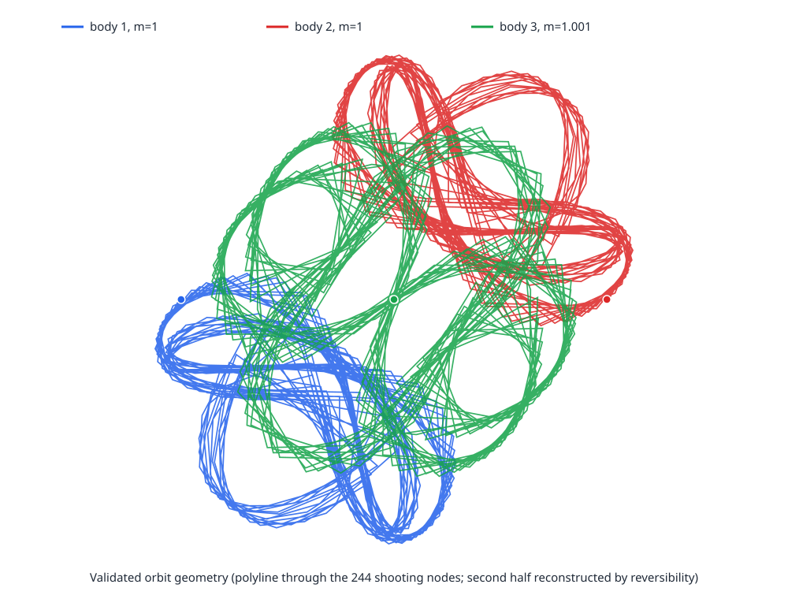

# A rigorously validated unequal-mass Moth-I¹³ periodic orbit

## Technical summary

We certify a collisionless periodic solution of the planar Newtonian three-body problem with \(G=1\) and masses
\[
(m_1,m_2,m_3)=\left(1,1,\frac{1001}{1000}\right).
\]
The normalized initial positions are \(q_1=(-1,0)\), \(q_2=(1,0)\), and \(q_3=(0,0)\). The velocities have the exact symmetry form
\[
v_1=v_2=(a,b),\qquad v_3=-\frac{2000}{1001}(a,b).
\]
A 1,955-dimensional outward-rounded Krawczyk calculation proves that a unique shooting root lies in
\[
|a-\bar a|\le10^{-14},\quad |b-\bar b|\le10^{-14},\quad
|\tau-\bar\tau|\le10^{-13},
\]
with radius \(10^{-14}\) for every shooting-node coordinate, where
\[
\bar a=0.4632255424493246161961696989282234060071831741469\ldots,
\]
\[
\bar b=0.3988159832923292289438092857690976537647786038697\ldots,
\]
\[
\bar\tau=96.95721801079469532830593565994101358608358855158\ldots.
\]
The labeled inertial-frame period lies in
\[
T=2\tau\in
[193.91443602158919065661187131988202717216717710315443564255,
193.91443602158959065661187131988202717216717710315443564255].
\]

The proof encloses every full time slab and establishes
\[
\min_{i<j,\;t\in[0,T]}\|q_i(t)-q_j(t)\|^2>0.003.
\]
Thus every pair distance exceeds \(\sqrt{0.003}>0.0547\). The strict Krawczyk inclusion has maximum normalized radius \(0.2296323\) and minimum componentwise margin \(7.70\times10^{-15}\). An independent rebuild of the archived checkers reproduced **PROOF_OK 1** and **certificate verified**.

The computed syzygy word is \((2132123123123213)^{13}\), placing the solution numerically in the Moth-I\(^{13}\) satellite class. Neither this topology nor its equal-mass seed is claimed as new. A broad finite catalog audit found no equivalent entry at the exact rational mass triple, so the defensible novelty statement is **apparently uncatalogued unequal-mass realization**. Minimal-period primitivity is supported numerically but is not part of the interval theorem.

## The validated orbit has intricate, bounded numerical geometry

The figure reconstructs a full trajectory from the certified 244-node half-orbit mesh and the exact reversing symmetry. It displays box centers only; the proof of existence and collision clearance comes from interval enclosures.

The closest sampled approach is about \(0.06104\). The rigorous tube certificate deliberately publishes the weaker full-period bound \(d>\sqrt{0.003}\).

## Exact model, normalization, and meaning of periodic

For \(i=1,2,3\),
\[
\dot q_i=v_i,\qquad
\dot v_i=\sum_{j\ne i}m_j\frac{q_j-q_i}{\|q_j-q_i\|^3}.
\]
The center of mass and total linear momentum are zero exactly. Eliminating body 3 gives
\[
q_3=-\frac{q_1+q_2}{\mu},\qquad
v_3=-\frac{v_1+v_2}{\mu},\qquad \mu=\frac{1001}{1000},
\]
and an eight-dimensional reduced flow in
\[
x=(q_{1x},q_{1y},q_{2x},q_{2y},v_{1x},v_{1y},v_{2x},v_{2y}).
\]
The initial symmetry makes total momentum and angular momentum exactly zero. “Periodic” means the labeled inertial state returns after the certified \(T\). The theorem proves that the minimal period divides \(T\); it does not rigorously exclude every earlier return.

## Reversibility converts the certified half-return into a full orbit

Define
\[
R(q_1,q_2,q_3;v_1,v_2,v_3)
=(-q_2,-q_1,-q_3;\ v_2,v_1,v_3).
\]
This involution reverses the flow: \(R^2=I\) and \(R\Phi_t=\Phi_{-t}R\). The initial state is in \(\operatorname{Fix}(R)\).

At the half-period endpoint \(X_N\), impose
\[
B(X_N)=
\begin{pmatrix}
q_{1x}+q_{2x}\\
q_{1y}+q_{2y}\\
q_1\cdot(v_1-v_2)
\end{pmatrix}=0.
\]
The first two equations give \(q_2=-q_1\). Conservation of the exact zero angular momentum gives \(q_1\times(v_1-v_2)=0\). The third equation supplies the complementary dot product. Since collision clearance implies \(q_1\ne0\), these relations force \(v_1=v_2\). Hence the endpoint is also in \(\operatorname{Fix}(R)\), and
\[
\Phi_{2\tau}(x_0)=x_0.
\]
This analytic step does not rely on a floating-point symmetry test.

## The 1,955-dimensional interval certificate proves existence and uniqueness

The half-orbit is split into \(N=244\) rigorously integrated segments whose exact fractions sum to one:
\[
198\left(\frac1{200}\right)+30\left(\frac1{3200}\right)
+16\left(\frac1{25600}\right)=1.
\]
The unknown vector is
\[
z=(a,b,\tau,X_1,\ldots,X_{244})\in\mathbb R^{1955}.
\]
The residual contains 244 eight-component continuity equations
\[
G_i=X_{i+1}-\Phi_{\alpha_i\tau}(X_i)
\]
and the three terminal equations \(B(X_{244})=0\).

Each local flow and first variational map was enclosed with outward-rounded Taylor/Picard interval integration. Center integrations used MPFI at 80 decimal digits. Outer derivative and tube enclosures used Boost.Interval with long-double endpoints, **-frounding-math -fno-fast-math**, and runtime directed-rounding tests.

For a fixed nonsingular preconditioner \(C\), the verifier evaluates
\[
K(\bar z,Z)=\bar z-CF(\bar z)+(I-C[DF(Z)])(Z-\bar z)
\]
with outward rounding. The strict inclusion \(K(\bar z,Z)\subset\operatorname{int}Z\) proves a root. A contraction bound below one yields uniqueness within the stated box.

| Certificate quantity | Rigorous value or bound |
|---|---:|
| Maximum center residual magnitude | \(2.5797308518\times10^{-21}\) |
| Preconditioner defect norm | \(1.1834248983\times10^{-6}\) |
| Maximum correction/radius ratio | \(5.8688647266\times10^{-3}\) |
| Maximum derivative/radius ratio | \(2.2376223205\times10^{-1}\) |
| Total contraction bound | \(2.2376341548\times10^{-1}<1\) |
| Maximum Krawczyk inclusion ratio | \(2.2963228020\times10^{-1}<1\) |
| Minimum inclusion margin | \(7.7036771980\times10^{-15}\) |
| Squared-separation lower bound | \(0.003\) |
| Final status | **PROOF_OK 1** |

The machine-readable values are in **reproduction/logs/final_certificate.txt**.

## Collisionlessness is proved on full time tubes

A small return residual cannot exclude a collision between samples. For every segment, the interval integrator encloses all states for every initial condition in the shooting box and for the whole local time interval. It evaluates all three squared separations on each tube. The raw enclosures stay above approximately \(0.0036067\); the assembled certificate publishes the weaker exact-decimal bound \(0.003\).

The second half is the reversed and relabeled first half under \(R\), which preserves pair distances. The first-half tube certificate therefore proves collisionlessness throughout the full period.

## Nonsingularity yields an unquantified local mass family

The certified shooting derivative is nonsingular. Away from collisions, the Newtonian flow and shooting map are smooth in the positive mass parameter \(\mu\). The implicit-function theorem therefore yields a local \(C^1\) branch of symmetric periodic solutions as \(\mu\) varies near \(1001/1000\), with the outer masses held equal.

The present calculation does not quantify this mass neighborhood or certify a uniform collision bound on a stated mass interval. The primary completed result is the single certified orbit at the exact rational mass.

## Topology and primitivity remain numerical characterizations

Ordinary high-accuracy integration gives
\[
E\approx-1.3818502425450523,\qquad
T|E|^{3/2}\approx314.993513098724,
\]
and the 208-symbol syzygy word \((2132123123123213)^{13}\).

Because this word is a proper thirteenth power, topology alone cannot distinguish a primitive satellite from thirteen traversals of a shorter Moth-I orbit. A derivative-refined numerical search found the smallest earlier identity-return stationary minimum near \(0.01162\), while the endpoint residual was about \(10^{-9}\); values at \(kT/13\), \(1\le k\le12\), were all at least \(0.0167\). This is strong numerical evidence, not a global interval exclusion.

## The finite catalog audit supports a conditional novelty claim

The duplicate screen normalized translation, rotation/reflection, time shift and reversal, Newtonian scaling, and simultaneous relabeling. Topological words were compared modulo cyclic phase, reversal, and label equivalences.

- The Li–Jing–Liao unequal-mass catalog sampled central masses \(0.5,0.75,2,4,5,8,10\), not \(1.001\).
- The large one-family supplement contains the mass triple \((1,1.001,1)\), but its orbit belongs to the one-copy **bABabaBAba** family with listed period about \(7.54087\), topologically distinct from Moth-I\(^{13}\).
- The Sofia 421,562-orbit Euler supplement and stable source list are equal-mass collections.
- BHH satellite catalogs concern another relative-periodic/topological family; recent finite-angular-momentum continuations are not comprehensive zero-angular-momentum unequal-mass catalogs.

The publication-safe claim is:

> We certify an apparently uncatalogued unequal-mass realization of the known Moth-I\(^{13}\) topological-power class at masses \((1,1,1001/1000)\).

This is conditional on accessible published sources, not proof against unpublished computations, inaccessible data, or future catalogs.

## Reproduction, limitations, and next questions

The **reproduction** directory contains the source, mesh, interval logs, and two verification routes. **scripts/verify_existing.sh** recompiles the checkers and verifies archived enclosures. **scripts/rerun_all.sh** regenerates all 244 center and outer integrations before rebuilding the proof. The quick route was rerun successfully here.

Reference environment: Ubuntu 24.04 under WSL2; GCC 13.3.0; Boost 1.83.0; GMP 6.3.0; MPFR 4.2.1; MPFI 1.5.3.

The trust boundary is:

- **Rigorous:** existence, labeled inertial periodicity, collisionlessness, local uniqueness in the box, and an unquantified local \(C^1\) mass continuation.
- **Numerical:** energy, scale-invariant period, syzygy word, sampled closest approach, and primitivity evidence.
- **Catalog-conditional:** apparent novelty.

Useful next steps are to interval-exclude every earlier return, certify the syzygy itinerary, continue the Krawczyk proof uniformly over an explicit mass interval, and archive an independent implementation.

## References

- P. Kapela and C. Simó, computer-assisted proofs for planar choreographies: https://ww2.ii.uj.edu.pl/~kapela/papers/nosym.pdf
- X. Li, Y. Jing, and S. Liao, unequal-mass catalog: https://doi.org/10.1093/pasj/psy057
- X. Li, X. Li, and S. Liao, one-family unequal-mass supplement: https://arxiv.org/abs/2007.10184
- Supplementary data: https://github.com/sjtu-liao/three-body/blob/main/non-hierarchical-3b-supplementary_data.txt
- Sofia equal-mass Euler catalog: https://db2.fmi.uni-sofia.bg/3bodyeuler/
- Moth satellites and topological powers: https://www.scl.rs/papers/Hudomal-JPA2018.pdf
